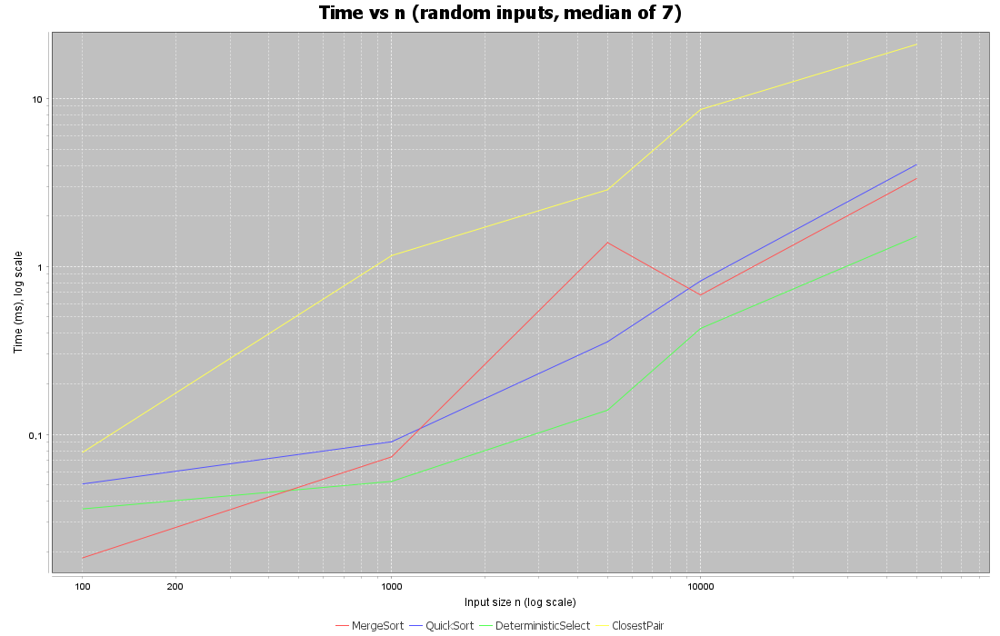
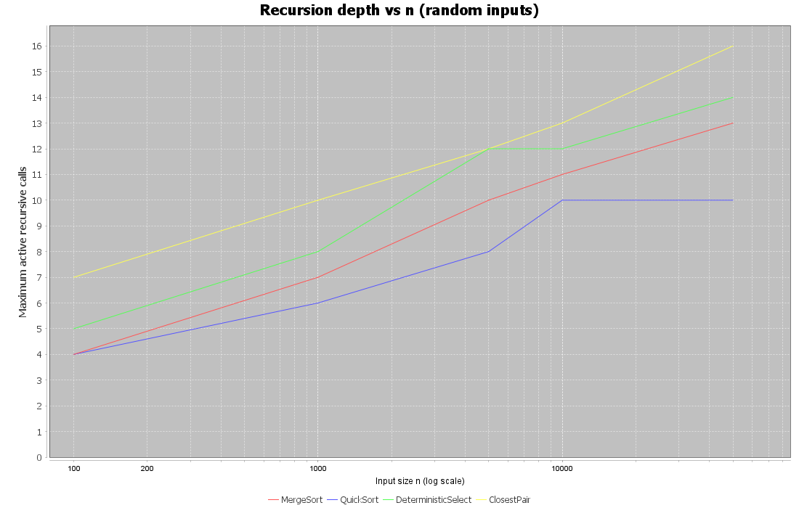
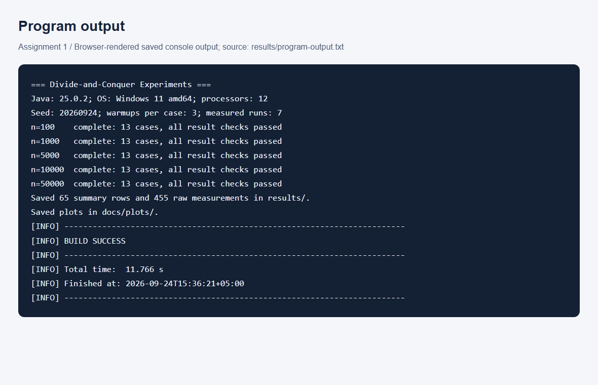
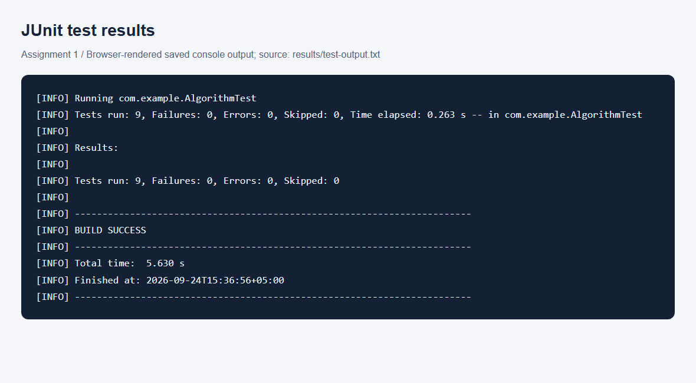

# Assignment 1: Divide-and-Conquer Algorithm Analysis

Java implementations of MergeSort, randomized QuickSort, deterministic selection
(Median-of-Medians), and Closest Pair of Points. The project compares recurrence
analysis with measured time, recursion depth, and operation counts.

## Run

Requires **JDK 21 or newer** and **Maven 3.6.3 or newer**. Run from the repository root:

```sh
mvn clean test
mvn compile exec:java
```

The first command runs JUnit tests; the second regenerates the CSV files and two PNG plots.
Make sure `JAVA_HOME` points to a JDK: Java 8 cannot compile this project.
In IntelliJ IDEA, select JDK 21+ as both the project SDK and Maven runner JDK.

## Repository structure

```text
src/main/java/com/example/
    MergeSorter.java          # Reusable merge buffer; insertion cutoff = 16
    QuickSorter.java          # Random pivot; three-way partition; smaller-first recursion
    DeterministicSelector.java
    ClosestPairSolver.java
    Experiment.java
    Point.java
    Main.java
tests/com/example/AlgorithmTest.java
docs/
    plots/                    # Generated time and depth plots
    screenshots/              # Captures of saved output and plots
results/
    results.csv               # Median time per algorithm/input/size
    raw_results.csv           # All seven measured runs per case
    program-output.txt
    test-output.txt
scripts/capture_evidence.py    # Optional screenshot regeneration
README.md
pom.xml
.gitignore
```

Maven's test source directory is explicitly set to `tests/` in `pom.xml`.

## Algorithm analysis

### MergeSort

Split the array in half, recursively sort both sides, and merge in linear time.
One auxiliary array is reused throughout the call; segments of at most 16 elements
use Insertion Sort. The merge chooses the left element on ties, preserving stability.

`T(n) = 2T(n/2) + Θ(n)`: Master Theorem case 2, with `a = b = 2`,
gives **Θ(n log n)** time in all cases for this implementation.
The constant cutoff does not change this bound. Auxiliary space is **O(n)**,
including an **O(log n)** recursion stack.

### QuickSort

Choose a uniformly random pivot and partition in place into values smaller than,
equal to, and greater than it. Skip the equal region, recurse on the smaller
nontrivial side, and process the larger side in a loop.

For distinct keys, balanced partitions give `T(n) = 2T(n/2) + Θ(n)`,
hence **Θ(n log n)** by Master Theorem case 2. Randomization gives expected
**Θ(n log n)** time. Extremely unbalanced partitions give
`T(n) = T(n - 1) + Θ(n) = Θ(n²)`; the Master Theorem does not apply to this recurrence.
All-equal input takes **Θ(n)** with the three-way partition.

Each nested call handles at most half the current elements. Therefore stack space
and maximum active recursion depth are **O(log n) even in the worst case**.
This stack guarantee does not eliminate the quadratic worst-case running time.

### Deterministic Select (Median-of-Medians)

For zero-based rank `k`, sort groups of at most five using Insertion Sort, move
their medians to the beginning of the working array, and recursively select the
median of those medians. Partition in place into three regions and recurse only
into the region containing `k`; return immediately if `k` lies in the equal region.
The public method clones the input so the caller's array remains unchanged.

At least `3n/10 - O(1)` elements are no smaller than the pivot and at least that
many are no larger. Thus the remaining strict side has at most `7n/10 + O(1)` elements:

`T(n) ≤ T(⌈n/5⌉) + T(7n/10 + O(1)) + O(n)`.

The ordinary Master Theorem does not cover unequal subproblem sizes.
For Akra–Bazzi intuition, `(1/5)^p + (7/10)^p = 1` has `p < 1`,
because the fractions sum to 0.9 at `p = 1`.
The linear work dominates, giving **Θ(n) worst-case time**.
Discarding all pivot-equal values is essential to retain this guarantee with duplicates.
Stack space is **O(log n)**; the public method uses **O(n)** auxiliary space because of its clone.

### Closest Pair of Points

Sort a copy of the points by x-coordinate and split by array index.
Each recursive slice returns in y-order; merge those orders in linear time.
Build a strip within distance `d` of the dividing line, where `d` is the best
distance from the two halves. In y-order, check at most the next seven neighbours,
stopping earlier when the y-gap reaches `d`. This also handles tied x-coordinates
and duplicate points without assigning a point to the wrong half.

After the initial sort, `T(n) = 2T(n/2) + Θ(n)`.
Master Theorem case 2 gives **Θ(n log n)** overall time.
The working copy and reusable merge/strip buffer use **O(n)** space;
recursion uses **O(log n)** space.

**API edge cases:** sorting accepts empty/singleton arrays (and treats null as a no-op).
Selection rejects null, empty input, or an invalid rank with `IllegalArgumentException`.
Closest Pair returns positive infinity when fewer than two points are supplied;
coordinates are assumed finite. Selection and Closest Pair preserve their inputs.

## Correctness tests

The saved [test output](results/test-output.txt) reports **9 test methods, 0 failures,
0 errors, 0 skipped**. Each method may contain many individual cases:

- Both sorts are compared with `Arrays.sort` on random, sorted, reverse-sorted,
  duplicate-heavy, empty, singleton, and negative-value inputs; sizes reach 50,000.
- Selection has 100 random rank checks, another 100 duplicate-heavy arrays checked
  at **every rank**, invalid-rank tests, integer extremes, and 50,000 equal values.
  The equal-value case also checks that comparison count remains linear.
- Closest Pair is compared with brute force on 20 random datasets, 100 tied-coordinate
  datasets, and a dataset of exactly 2,000 points. Empty/singleton inputs and coincident
  points are covered. A 50,000-point collinear dataset has known distance 3.
- Tests check input preservation, metric resets, base-case distance counting, and
  QuickSort's logarithmic stack bound.

## Experiments and results

Recorded on **2026-09-24**, Windows 11 amd64, OpenJDK 25.0.2,
Intel Core i5-12450H (12 logical processors).
Each of the 65 cases uses **3 warm-up runs followed by 7 measured runs**;
the reported time is the median, measured with `System.nanoTime()`.
The input and QuickSort seeds are fixed at `20260924`; every repetition receives
the same input and pivot sequence. Timings remain machine- and run-dependent.

Sizes are **100, 1,000, 5,000, 10,000, and 50,000**. Integer inputs are random,
sorted, reverse-sorted, or duplicate-heavy (10 possible values).
Selection requests `k = n/2`. Closest Pair uses uniformly random points in
`[0, 1000) × [0, 1000)`.

Input generation, external copies, and reference checks are outside timing.
Allocations inside each public method, including the selector's clone and Closest
Pair's initial sort, are included. Every sorting/selection result is checked;
Closest Pair is checked against brute force for experiment sizes up to 2,000.
Larger random point sets receive a finite/nonnegative-result check.

**Metrics:** depth counts simultaneously active recursive algorithm calls, root = 1;
no recursive call means 0. Selection includes the median-of-medians recursion.
`Comparisons` counts element comparisons for integer algorithms, including
insertion sorting; for Closest Pair it counts **distance evaluations**, including
base cases, but excludes coordinate comparisons during sorting/merging.
These operation counts should not be compared directly across different algorithms.
Depth and operation counts are deterministic for each seeded case.

### Time on random inputs (milliseconds)

| n | MergeSort | QuickSort | DeterministicSelect | ClosestPair |
| --- | --- | --- | --- | --- |
| 100 | 0.0184 | 0.0507 | 0.0360 | 0.0782 |
| 1,000 | 0.0735 | 0.0904 | 0.0525 | 1.1619 |
| 5,000 | 1.3871 | 0.3563 | 0.1394 | 2.8656 |
| 10,000 | 0.6767 | 0.8204 | 0.4276 | 8.6092 |
| 50,000 | 3.3413 | 4.0444 | 1.5091 | 21.0363 |

### Maximum recursion depth on random inputs

| n | MergeSort | QuickSort | DeterministicSelect | ClosestPair |
| --- | --- | --- | --- | --- |
| 100 | 4 | 4 | 5 | 7 |
| 1,000 | 7 | 6 | 8 | 10 |
| 5,000 | 10 | 8 | 12 | 12 |
| 10,000 | 11 | 10 | 12 | 13 |
| 50,000 | 13 | 10 | 14 | 16 |

### Input structure at n = 50,000

Each entry is **milliseconds / maximum depth**.

| Input | MergeSort | QuickSort | DeterministicSelect |
| --- | --- | --- | --- |
| Random | 3.3413 / 13 | 4.0444 / 10 | 1.5091 / 14 |
| Sorted | 0.9488 / 13 | 2.0045 / 10 | 0.6716 / 15 |
| ReverseSorted | 0.9719 / 13 | 2.2498 / 10 | 0.7347 / 14 |
| Duplicates | 2.2994 / 13 | 1.1701 / 2 | 1.3461 / 8 |

All sizes and input types are available in [results.csv](results/results.csv).
The [455 raw measurements](results/raw_results.csv) retain timing variability;
the summary's other metrics come from the median-time run.

### Plots

Both plots show random inputs (random points for Closest Pair).
The x-axis is logarithmic so the unequal input sizes have meaningful spacing;
the time plot also uses a logarithmic y-axis.





## Discussion

**Do measurements match theory?** Operation counts support the expected trends:
from 10,000 to 50,000 random integers, MergeSort comparisons increase from 126,864
to 769,484 (6.07×), while selection increases from 98,565 to 496,356 (5.04×).
These are consistent with n log n and linear growth, respectively.
The timings are noisier: MergeSort at 5,000 is slower than at 10,000 in this run.
A short warm-up does not fully remove JIT compilation and scheduling effects;
these measurements illustrate trends, not a proof of asymptotic bounds.

**How does input structure matter?** At 50,000 elements, MergeSort takes about
0.95 ms on sorted input versus 3.34 ms on random input: ordered insertion-sort
segments and merging require fewer comparisons. QuickSort takes about 1.17 ms
on duplicate-heavy data versus 4.04 ms on random data, because equal regions are
discarded together. Random pivots prevent sorted input from systematically becoming
the bad case. Selection also benefits from removing large equal regions.

**Why smaller-first recursion?** Only the smaller side creates another stack frame,
so the active problem size at least halves per nested call. At 50,000 random keys,
QuickSort's measured depth is 10, compared with MergeSort's 13.
Tail iteration saves stack space, not partitioning work.

**Why is Median-of-Medians linear?** Groups of five guarantee a pivot that discards
a fixed fraction of elements; the pivot-selection and retained-side fractions sum
to less than one. Three-way partitioning preserves this property with equal keys.

**Why is Closest Pair faster than brute force at scale?** Brute force evaluates
`n(n - 1)/2` distances, whereas the strip packing bound limits local checks to a
constant per point per level. At 50,000 points, brute force would check
1,249,975,000 pairs; this run evaluates 71,048 distances. Sorting and merging still
contribute O(n log n) work, so distance count alone is not the total running time.
Large brute-force timing was intentionally not performed.

**Practical limitations:** JVM warm-up, JIT compilation, garbage collection, CPU
cache locality, branch prediction, allocations, and OS scheduling affect time.
Instrumentation itself adds work. A single JVM with a fixed case order and seven
repetitions is a small teaching experiment, not a rigorous microbenchmark;
additional JVM forks and varied seeds would strengthen performance conclusions.

## Reflection

This assignment helped me connect divide-and-conquer recurrences with Java
implementations. I learned that recursion depth and running time measure different
things: smaller-first QuickSort can keep a shallow stack even when its total work
is quadratic. Comparing measured operation counts with timings also showed why
short experiments do not always follow a smooth theoretical curve.

The main implementation challenges were duplicate values in selection, tied
x-coordinates in Closest Pair, and accurate metric accounting. Three-way partitioning,
splitting points by index while merging y-order, and testing against sorted arrays
or brute force made these cases easier to verify. Reproducible inputs and saved
raw measurements made it possible to trace the report back to actual runs.

## Screenshots and submission

The screenshots below display **saved output rendered in a browser**.
The underlying text logs are linked above; the [combined plot screenshot](docs/screenshots/plots.png)
shows the same generated charts.





Optional screenshot regeneration (Python 3 and Chrome installed):

```sh
python scripts/capture_evidence.py
```

Repository URL: **https://github.com/Mardan7/DAA-ASS1**

The existing Git history is retained. New commits should describe actual changes;
an example commit storyline is not evidence of work and should not be recreated
retroactively. Submit the repository URL after committing and pushing the final files.